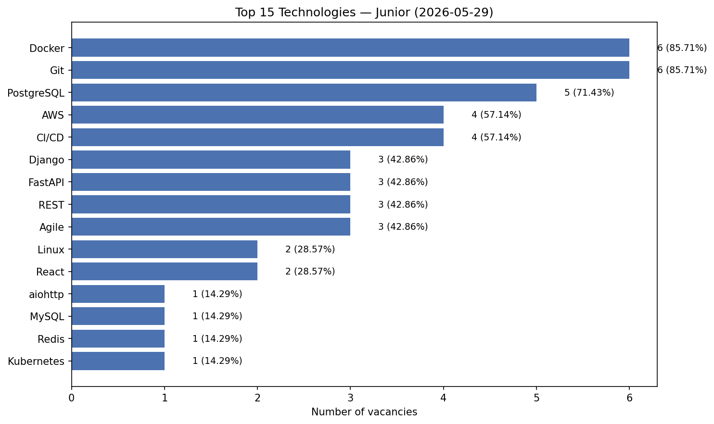
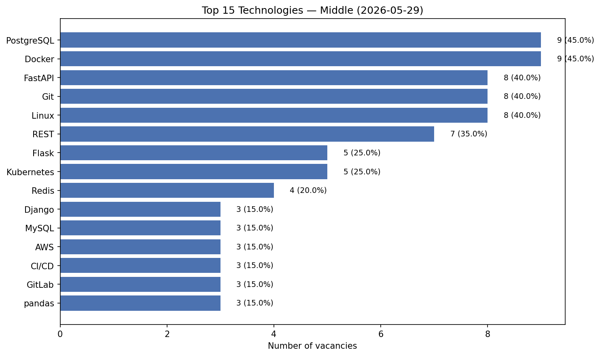
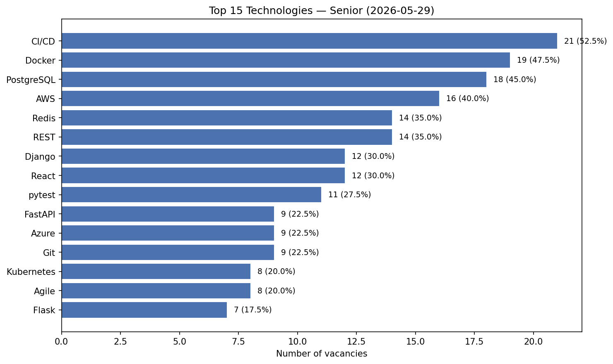

# Tech Market Analyzer

Сервіс для збору публічних вакансій Python-розробників та аналізу попиту на технології на ринку праці.

## Можливості

- **Scraping** — збір вакансій з [jobs.dou.ua](https://jobs.dou.ua) (публічні дані, без авторизації)
- **Analysis** — підрахунок згадок технологій у описах вакансій
- **Візуалізація** — bar chart топ-технологій
- **Історія** — збереження знімків для порівняння трендів у часі
- **Рівні досвіду** — окремий аналіз для junior / middle / senior
- **Незалежні модулі** — scraping і analysis запускаються окремо (SRP)

## Структура проекту

```
tech-market-analyzer/
├── config/
│   └── technologies.yaml     # Список технологій для пошуку
├── docs/
│   └── images/               # Скріншоти діаграм для README
├── src/tech_market_analyzer/
│   ├── settings.py           # Pydantic Settings
│   ├── domain/               # Моделі та інтерфейси
│   ├── scraping/             # Частина 1: збір даних
│   ├── analysis/             # Частина 2: аналіз
│   ├── storage/              # JSON + результати
│   └── cli.py                # Єдина точка входу
├── data/
│   ├── raw/                  # JSON знімки вакансій
│   └── results/              # Діаграми + статистика
└── tests/
```

## Встановлення

```bash
git clone https://github.com/arsenmarkotskyi/tech-market-analyzer.git
cd tech-market-analyzer

python -m venv .venv
source .venv/bin/activate  # Windows: .venv\Scripts\activate

pip install -e ".[dev]"
cp .env.example .env
```

## Використання

### Повний pipeline

```bash
# scrape → analyze для junior, middle, senior
tech-analyzer pipeline --all-levels --force
```

Приклад виводу після запуску (2026-05-29):

| Рівень | Фільтр DOU | Вакансій | Топ-3 технології |
|--------|------------|----------|------------------|
| junior | `exp=0-1` | 7 | Docker, Git, PostgreSQL |
| middle | `exp=1-3` | 20 | PostgreSQL, Docker, FastAPI |
| senior | `exp=3-5` + `exp=5plus` | 40 | CI/CD, Docker, PostgreSQL |

Файли: `data/raw/2026-05-29_{level}.json` та `data/results/2026-05-29/{level}_*`.

### Окремо: Scraping

```bash
# Один рівень
tech-analyzer scrape --level senior

# Всі рівні
tech-analyzer scrape --all-levels

# Перезаписати сьогоднішній знімок
tech-analyzer scrape --all-levels --force
```

### Окремо: Analysis

```bash
# Останній знімок
tech-analyzer analyze --latest --level senior

# Конкретний файл
tech-analyzer analyze --input data/raw/2026-05-29_senior.json
```

### Порівняння історії

```bash
tech-analyzer history 2026-05-20 2026-05-29 --level senior
```

## Приклад результату

Після аналізу в `data/results/YYYY-MM-DD/` з'являться:

- `{level}_bar_chart.png` — діаграма топ-технологій
- `{level}_stats.json` — статистика у JSON

### Аналіз ринку (знімок 2026-05-29, [jobs.dou.ua](https://jobs.dou.ua))

**Загальні висновки:**

- **Docker** і **PostgreSQL** — найстабільніший попит: присутні у топ-3 на всіх рівнях досвіду.
- **CI/CD** різко зростає з рівнем: 57% (junior) → 15% (middle) → **53% (senior)** — для senior це №1 технологія.
- **FastAPI** найпопулярніший серед middle (40%), тоді як **Django** сильніший на senior (30%).
- Junior-ринок малий (7 вакансій), але вже вимагає DevOps-базу: Docker (86%), Git (86%), AWS (57%).

**Діаграми по рівнях:**

| Junior (7) | Middle (20) | Senior (40) |
|:---:|:---:|:---:|
|  |  |  |

### Топ-5 технологій по рівнях

**Junior** (`exp=0-1`, 7 вакансій):

```
   1. Docker        6  (85.7%)
   2. Git           6  (85.7%)
   3. PostgreSQL    5  (71.4%)
   4. AWS           4  (57.1%)
   5. CI/CD         4  (57.1%)
```

**Middle** (`exp=1-3`, 20 вакансій):

```
   1. PostgreSQL    9  (45.0%)
   2. Docker        9  (45.0%)
   3. FastAPI       8  (40.0%)
   4. Git           8  (40.0%)
   5. Linux         8  (40.0%)
```

**Senior** (`exp=3-5` + `exp=5plus`, 40 вакансій):

```
   1. CI/CD        21  (52.5%)
   2. Docker       19  (47.5%)
   3. PostgreSQL   18  (45.0%)
   4. AWS          16  (40.0%)
   5. Redis        14  (35.0%)
```

> **Примітка про DOU.ua:** фільтр категорії використовує `?category=Python` (не `search`).
> Для рівнів досвіду DOU використовує діапазони: `exp=0-1` (junior), `exp=1-3` (middle),
> `exp=3-5` та `exp=5plus` (senior — обидва фільтри, результати об'єднуються).

## Конфігурація

| Параметр | Файл | Опис |
|----------|------|------|
| Технології | `config/technologies.yaml` | Ключові слова для пошуку |
| Категорія DOU | `.env` → `CATEGORY` | Категорія вакансій (за замовч. `Python`) |
| HTTP delay | `.env` → `REQUEST_DELAY_SECONDS` | Затримка між запитами |
| Max pages | `.env` → `MAX_PAGES` | Ліміт сторінок пагінації |

## Тести

```bash
pytest
```

## Майбутні покращення (optional)

- Async scraping з `aiohttp`
- NLP-аналіз без config через `nltk` + `wordcloud`
- Кореляційний аналіз views/applications

## Disclaimer

Проект збирає лише **публічну** інформацію без авторизації. Дотримуйтесь `robots.txt` та Terms of Service сайту. Використовуйте rate limiting, щоб не перевантажувати сервер.

## Ліцензія

MIT
